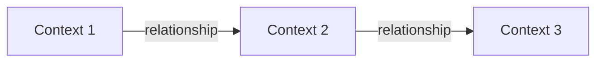
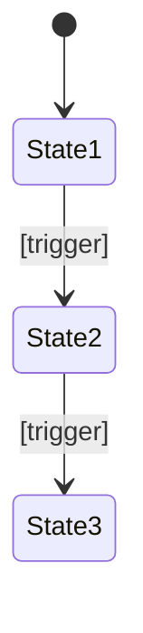
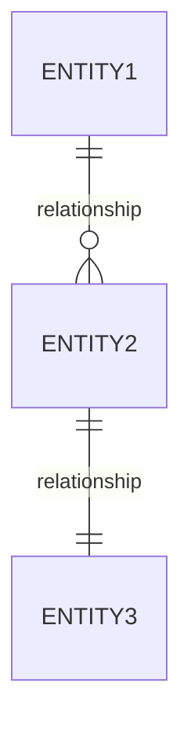

# Domain Model: [Project Name]

## Overview

[1-2 sentences: what domain this model covers and the product's core value proposition]

## Bounded Contexts

### [Context 1 Name] — Core Domain
**Responsibility:** [what this context owns and why it matters]
**Key Entities:** [list of main entities]
**Type:** Core / Supporting / Generic

### [Context 2 Name] — Supporting Domain
**Responsibility:** [what this context owns]
**Key Entities:** [list]
**Type:** Core / Supporting / Generic

### Context Map

## Entities by Context

### [Context Name]: [Entity Name]

**Type:** Aggregate Root | Entity | Value Object

**Attributes:**
| Attribute | Type | Required | Notes |
|-----------|------|----------|-------|
| [name] | [type] | Yes/No | [constraint or default] |

**Relationships:**
| Related Entity | Context | Cardinality | Type |
|---------------|---------|-------------|------|
| [Entity] | [Context] | 1:N, N:M, 1:1 | Association, Composition |

**Business Rules:**
- [Rule 1: invariant or constraint]
- [Rule 2: invariant or constraint]

**Lifecycle States** (if stateful):

## Entity-Relationship Diagram

## Ubiquitous Language Glossary

| Term | Definition | Context | Related Terms |
|------|-----------|---------|---------------|
| [Term] | [precise definition] | [Context name] | [linked terms] |

## Assumptions and Decisions

| Decision | Rationale | Date |
|----------|-----------|------|
| [Decision made] | [Why] | YYYY-MM-DD |
